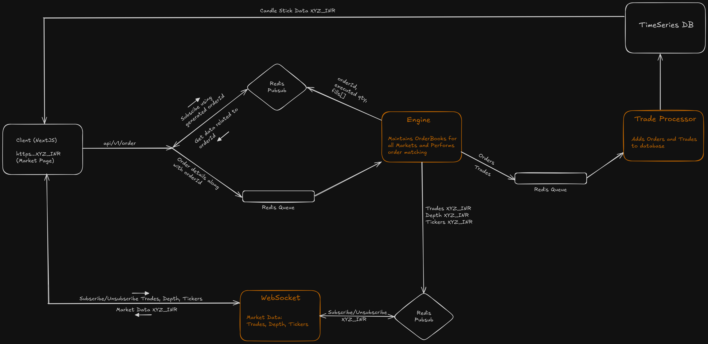

# Stock Exchange System Flow

This document outlines the real-time stock exchange flow, focusing on the WebSocket and Redis-based architecture, covering both client-side and server-side processes for market data subscription and order matching.

---

## Client-Side Subscription Flow

### 1. User Visits a Market Page (e.g., "XYZ_INR"):

When a user navigates to a specific market page (e.g., `/markets/XYZ_INR`), the client establishes a WebSocket connection and subscribes to three key types of market data:

- **TICKER**: Real-time price ticker of the market.
- **DEPTH**: The order book (bid/ask depth) for the market.
- **TRADE**: Real-time trade updates for the market.

The client registers callback functions to handle these updates, triggering UI updates for each component (TICKER, DEPTH, TRADE) based on the incoming data.

### 2. User Leaves the Market Page:

When the user navigates away from the market page, the client does the following:

- **Unsubscribes** from the WebSocket updates for `TICKER`, `DEPTH`, and `TRADE`.
- Deregisters callback functions to ensure no more updates are received for `XYZ_INR`.

This efficient handling ensures no unnecessary data is processed or displayed.

---

## WebSocket Server-Side Handling

### 1. Receiving the Subscription:

Upon receiving a WebSocket `SUBSCRIBE` message from a client for a specific market (e.g., `XYZ_INR`), the WebSocket server tracks how many users are subscribed to that market.

- If multiple users subscribe to the same market, the server keeps a count to track active users for that market.

### 2. Redis Pub/Sub Subscription:

- The WebSocket server subscribes to the **Redis Pub/Sub** channel for `XYZ_INR` if it is the **first user** subscribing.
- Redis Pub/Sub broadcasts real-time updates for `TICKER`, `DEPTH`, and `TRADE`.
- The WebSocket server forwards these updates to all subscribed WebSocket clients.

### 3. Unsubscribing:

- When an `UNSUBSCRIBE` message is received, the server reduces the subscription count for the market.
- If the last user unsubscribes, the WebSocket server unsubscribes from the corresponding Redis Pub/Sub channel to avoid receiving unnecessary updates.

---

## Order API Flow

### 1. Submitting an Order:

When a user places an order via the **Order API**, the following process occurs:

- A unique `orderId` is generated (either on the client-side or server-side) for tracking the order.
- The WebSocket server (or client) subscribes to the **Redis Pub/Sub** channel for the specific `orderId` to receive updates on this order.
- The order details (including `orderId`, price, quantity, and side) are pushed to a Redis queue (e.g., `order_queue`), which is consumed by the order-matching engine.

### 2. Order Matching:

- The **Order Matching Engine** processes the order from the Redis queue (`order_queue`), matching it with existing orders.
- As orders are matched, **fills** (completed portions of the order) are generated. 
- Updates related to fills, partial fills, or cancellations are published to the Redis Pub/Sub channel for the specific `orderId`.

### 3. Receiving Order Updates:

- The WebSocket server (or client) is subscribed to the Redis Pub/Sub channel for the specific `orderId`.
- When updates are published (fills, cancellations, etc.), the WebSocket server forwards them to the client through the WebSocket connection.

### 4. Order Completion:

- Once an order is fully matched, canceled, or completed, the WebSocket server (or client) unsubscribes from the Redis Pub/Sub channel for the `orderId`.
- This prevents further updates from being sent for the completed order, optimizing resource use.

---

## Summary

This system ensures real-time updates for both market data and order management by leveraging WebSockets and Redis Pub/Sub. The flow efficiently manages user subscriptions to markets and orders, ensuring only necessary updates are sent and tracked.

---

## Stock Exchange System Flow

